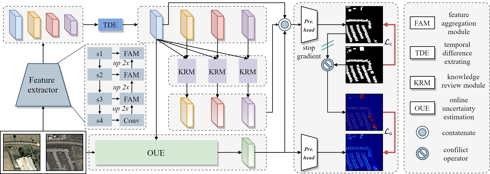

# 
`Towards Accurate and Reliable Change Detection of Remote Sensing Images via Knowledge Review and Online Uncertainty Estimation (Under Review)`

This repository contains simple python implementation of our paper [AR-CDNet](https://arxiv.org/abs/2305.19513).

### 1. Overview

      

A framework of the proposed AR-CDNet. Initially, the bi-temporal images pass through a shared feature extractor to obtain bi-temporal features, and then multi-level temporal difference features are obtained through the TDE. The OUE branch estimates pixel-wise uncertainty supervised by the diversity between predicted change maps and corresponding ground truth in the training process. KRMs fully explore the multi-level temporal difference knowledge. Finally, the multi-level temporal difference features and uncertainty-aware features obtained from the OUE branch are aggregated to generate the final change maps.  

### 2. Citation

Please cite our paper if you find the work useful:

    @article{Li_2023_MSL-MKC,
            title={Towards Accurate and Reliable Change Detection of Remote Sensing Images via Knowledge Review and Online Uncertainty Estimation},
            author={Li, Zhenglai and Tang, Chang and Li, Xianju and Xie, Weiying and Sun, Kun and Zhu, Xinzhong},
            journal={arXiv preprint arXiv:2305.19513},
            year={2023}
        }
